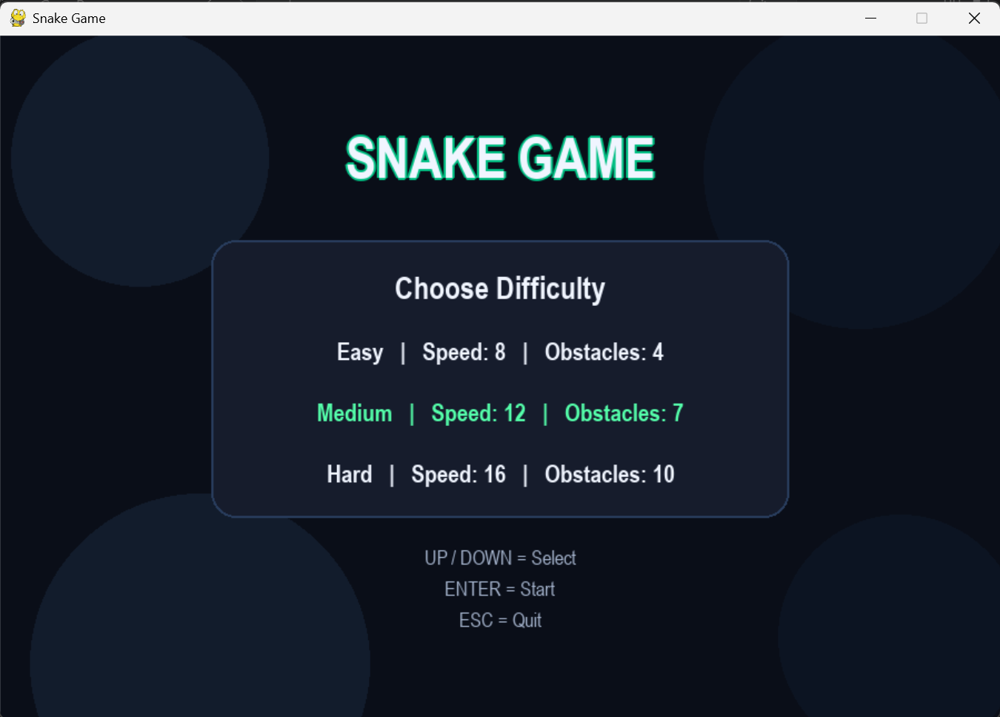
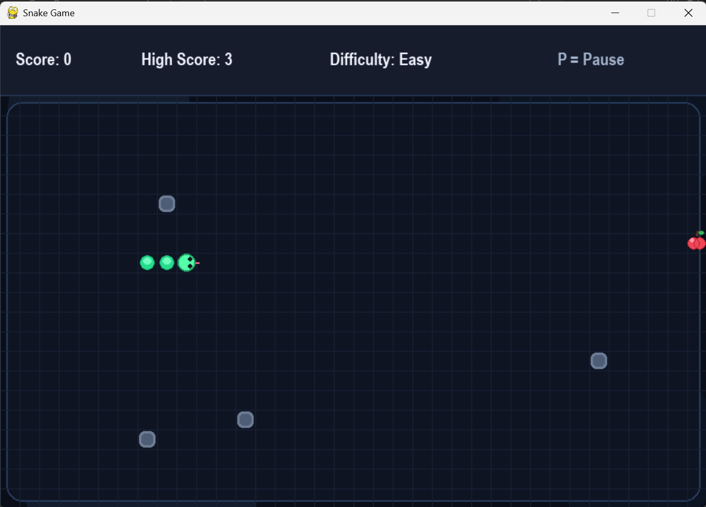
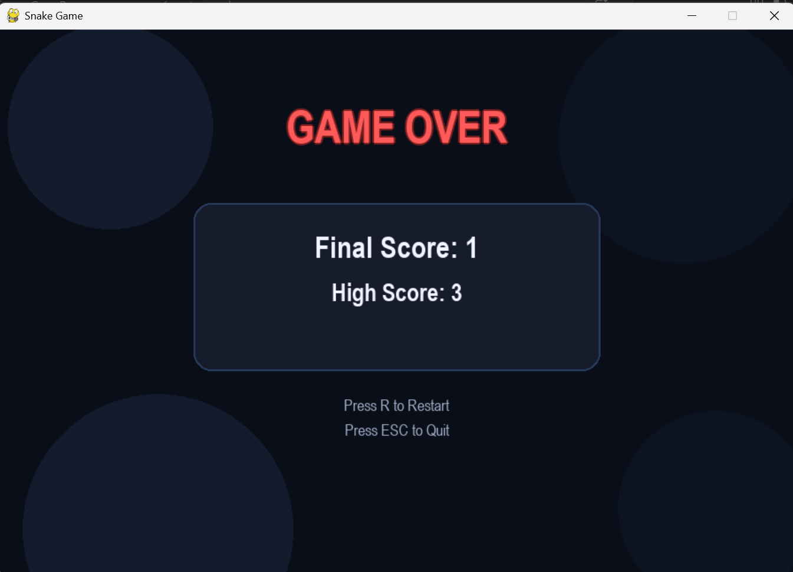

# Snake Game

A simple Snake Game built using Python and Pygame.  
This was one of my early projects where I focused on understanding game logic, handling real-time input, and making the gameplay smooth and responsive.

---

## Features

- Smooth snake movement  
- Score tracking with high score saving  
- Multiple difficulty levels  
- Obstacles to increase challenge  
- Pause, resume, and restart functionality  
- Custom snake and fruit design  
- Bonus golden fruit for extra points  

---

## Tech Stack

* Python
* Pygame

---

## Project Structure

snake-game/
   │── main.py
   │── highscore.txt
   │── requirements.txt
   │── README.md

---

## How to Run

1. Clone the repository  
   git clone

2. Navigate into the folder  
   cd snake-game

3. Install dependencies  
   pip install -r requirements.txt

4. Run the game  
   python main.py

---

## Controls

- Arrow Keys → Move  
- Enter → Start  
- P → Pause / Resume  
- R → Restart  
- Esc → Quit  

---

## What I Learned

- Implementing game loops and handling real-time input  
- Collision detection logic  
- Managing different game states (start, pause, game over)  
- Improving gameplay experience through UI and small design changes  

---

## About the Project

This project focuses on building a complete game loop with proper collision handling and user input management.  
I also spent time improving the visuals and overall gameplay feel beyond a basic implementation.

---

## Future Improvements

- Sound effects and background music  
- Additional animations and effects  
- More gameplay modes    

## Preview

